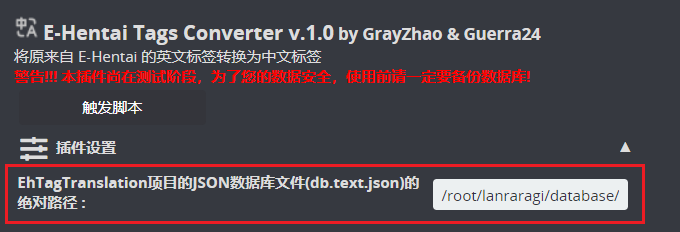
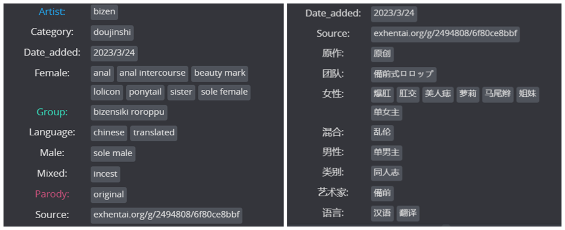

# ETagConverter - LANraragi 英文标签批量翻译脚本

这是一个适用于LANraragi的脚本插件，功能是将数据库中的来自E-Hentai上的英文标签批量翻译为中文标签。

## 简介
该脚本参考Guerra24编写的nHentai Source Converter脚本进行编写，结合EhTagTranslation项目提供的数据库，批量翻译来自E-Hentai插件搜刮的英文标签为中文标签。

该脚本是在ChatGPT帮助下开发的(我没有Perl编程基础，只简单了解其基本语法)，所以可能会有不明BUG出现，还请给位见谅。若遇到相关问题可以提交Issues，我会尝试去解决。也欢迎各位大佬帮助完善该插件，在此谢谢诸位😃

该脚本是[Difegue / LANraragi](https://github.com/Difegue/LANraragi)项目的脚本插件，同样也适用于[uparrows/LANraragi_cn](https://github.com/uparrows/LANraragi_cn)项目。

## 使用方法(Docker为例)
**P.S. 该脚本在执行过程中会操作数据库，为了您的数据安全，在此强烈建议您备份原有数据库！！！**

1. 下载脚本
2. 上传脚本至LANraragi
3. 下载最新的[EhTagTranslation/Database](https://github.com/EhTagTranslation/Database/releases)中文标签数据库`db.text.json`，并放置在`LANraragi`镜像的`database`目录下
4. 打开该脚本配置，填写中文标签数据库绝对路径
    
    + 官方Docker镜像的用户，路径可填写`/home/koyomi/lanraragi/database/db.text.json`
    + **浅笑一夏**大佬汉化Docker镜像的用户，路径可填写`/root/lanraragi/database/db.text.json`
5. 保存脚本配置
6. 点击"触发脚本"，执行脚本

## 预览

## 感谢支持
+ Guerra24大佬编写的nHentai Source Converter脚本
+ [EhTagTranslation](https://github.com/EhTagTranslation)项目
